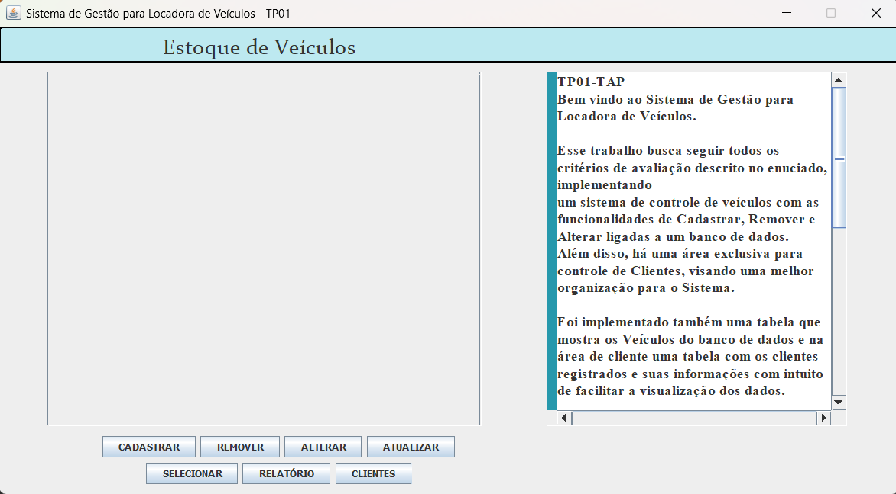
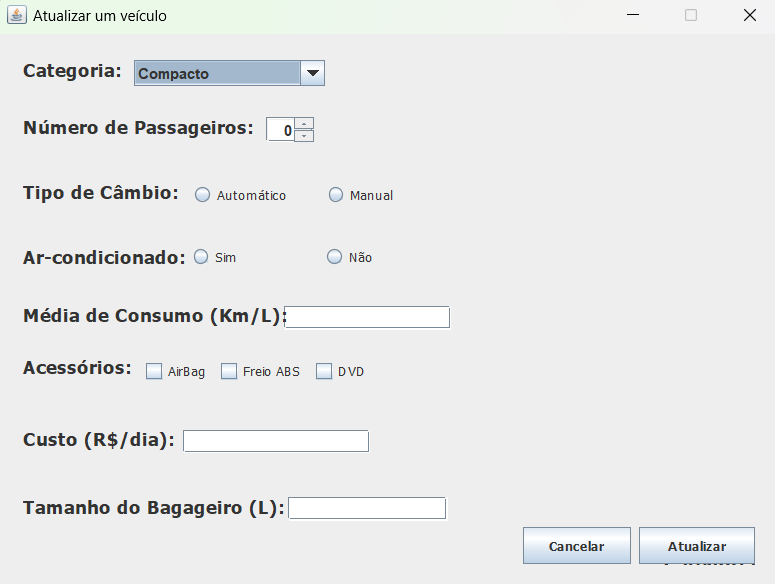
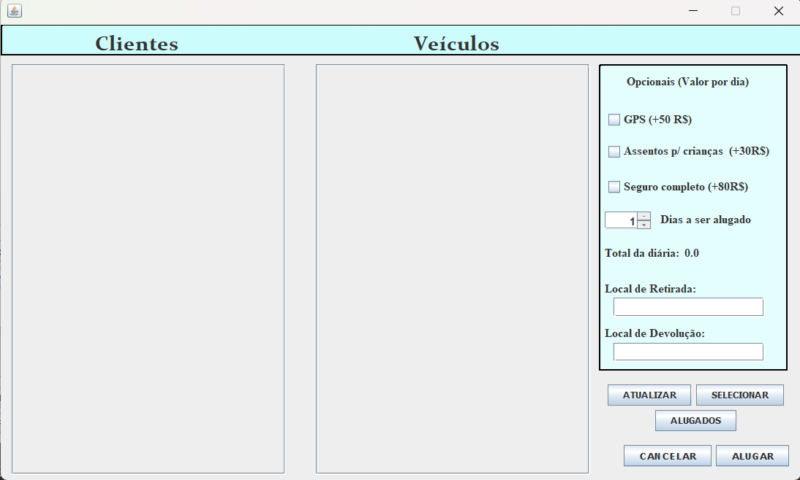
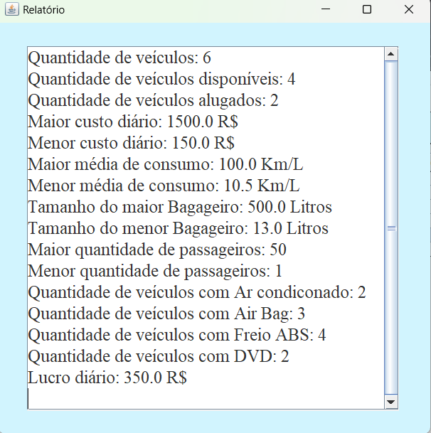
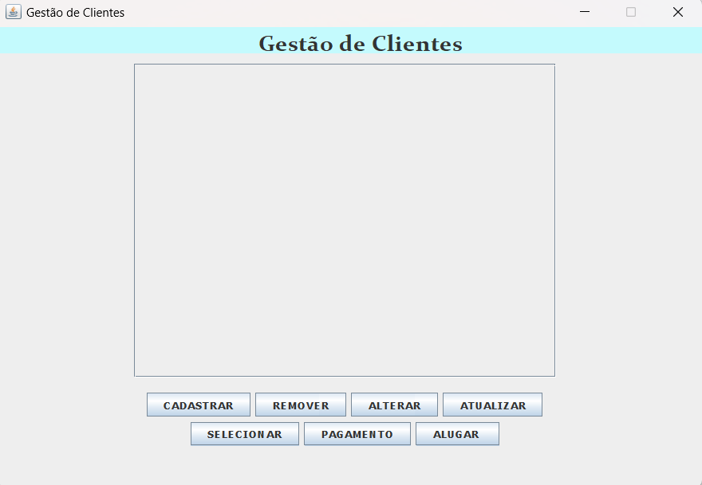
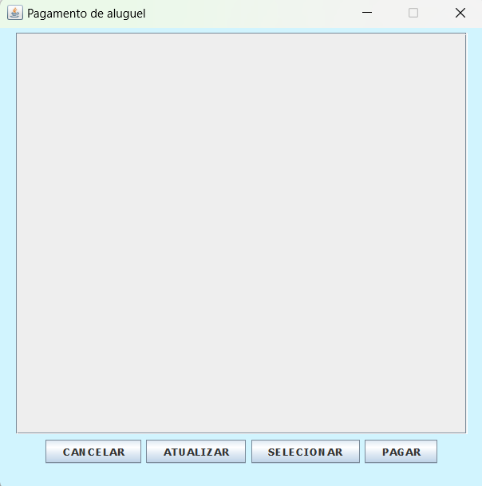

## Sistema de Gestão de Locadora de Veículos

Um sistema desktop em Java Swing desenvolvido para gerenciamento de frotas, clientes e contratos de aluguel de veículos. O projeto faz uso do padrão arquitetural DAO (Data Access Object) para persistência de dados em banco MySQL e conta com tratamento completo de validações de regras de negócio.

---

## Tecnologias Utilizadas

- Linguagem: Java (JDK 8 ou superior)

- Interface Gráfica: Java Swing / AWT

- Banco de Dados: MySQL

- Conectividade: JDBC (Java Database Connectivity)

---

## Entregáveis do Projeto

* **[Código Fonte Completo](src/):** Módulos de domínio, persistência (DAO), interface gráfica e exceções personalizadas.
* **[Mapeamento do Banco de Dados](/schema/script_banco.sql):** Scripts e estruturas relacionais para as tabelas `VEICULOS`, `CLIENTES` e `ALUGADOS`.
* **[Tratamento de Exceções](src/excecoes/):** Regras de validação customizadas (`NumeroForaDoIntervaloException`, `IdadeInvalidaException`, `NomeInvalidoException`, `CpfInvalidoException`, `DataInvalidaException`, `Trab01Exceptions`).* **Documentação Técnica:** Arquivo `README.md` detalhando arquitetura, configuração e funcionalidades.
* **[Apresentação do Projeto](/docs/apresentacao.pdf):** Slides explicativos em PDF cobrindo a arquitetura, modelo de dados e demonstração do sistema.

---

## Arquitetura e Estrutura do Projeto

O sistema organiza suas responsabilidades dividindo o domínio, a camada de acesso ao banco de dados e a interface gráfica:

```text
src/
├── Trab_Pratico_01.java                  # Classe principal que inicializa o sistema (Main)
├── Conexao.java                          # Gerenciador de conexão JDBC com MySQL
├── Cliente.java                          # Entidade de domínio (Model - Cliente)
├── Veiculo.java                          # Entidade de domínio (Model - Veículo)
├── ClientesDAO.java                      # Operações de CRUD para Clientes
├── VeiculosDAO.java                      # Operações de CRUD e métricas para Veículos
├── AlugadosDAO.java                      # Controle de locações e devoluções
├── JanelaPrincipal.java                  # Tela de navegação principal da aplicação
├── JanelaCadastroClientes.java           # Interface de formulário para novos clientes
├── JanelaAlterarClientes.java            # Interface de edição de clientes
├── JanelaCadastroVeiculos.java           # Interface de formulário para novos veículos
├── JanelaAlterarVeiculos.java            # Interface de edição de veículos
├── JanelaAlugarDevolver.java             # Interface para efetuar locação e devolução
├── JanelaAlugados.java                   # Listagem visual de veículos alugados
├── JanelaRelatorio.java                  # Painel de relatório financeiro e estatísticas
├── NumeroForaDoIntervaloException.java  # Exceção customizada (raiz do src)
└── excecoes/                             # Pacote de exceções customizadas do sistema
    ├── IdadeInvalidaException.java
    ├── NomeInvalidoException.java
    ├── Trab01Exceptions.java
    └── DataInvalidaException.java
```

---

## Funcionalidades Principais

### Gestão de Veículos

- Cadastro Detalhado: Inserção de atributos como categoria, capacidade de passageiros, litragem do bagageiro, tipo de câmbio, acessórios (ar, airbag, ABS, DVD) e custo da diária.

- Validação de Limites: Tratamento de exceções via NumeroForaDoIntervaloException para impedir dados numéricos irreais (ex: bagageiro ou passageiros fora de faixas permitidas).

- Edição e Remoção: Atualização e exclusão de veículos diretamente no acervo.

### Gestão de Clientes

- Validações de Segurança: Verificação de nome mínimo, idade mínima (18 anos), formato do CPF (11 dígitos) e status da CNH.

- Manutenção: Interface própria para alteração cadastral de clientes.

### Controle de Aluguel e Devolução

- Locação: Vincula um veículo disponível a um cliente e atualiza o status de disponibilidade no banco.

- Devolução: Libera o veículo novamente para a frota disponível.

- Visualização: Tabela dinâmica em Swing para acompanhamento das locações ativas.

### Relatórios e Métricas

Painel consolidado com estatísticas gerais do sistema: total de veículos, taxa de ocupação, total de clientes cadastrados e projeção da receita diária dos aluguéis.

---

## Demonstração da Interface

| Tela Principal | Cadastro de Veículos |
| :---: | :---: |
|  |  |

| Gestão de Aluguéis | Relatório Financeiro |
| :---: | :---: |
|  |  |


| Gestão de Clientes | Gestão de Pagamentos |
| :---: | :---: |
|  |  |

---

## Configuração e Execução

1. Configurar o Banco de Dados

Certifique-se de que o servidor MySQL esteja em execução e configure os parâmetros no arquivo Conexao.java:

```Java
// Exemplo de configuração em Conexao.java
String url = "jdbc:mysql://localhost:3306/locadora_db";
String usuario = "root";
String senha = "sua_senha";
```

2. Adicionar o Driver JDBC

Adicione a biblioteca MySQL Connector/J (.jar) ao Build Path do seu projeto no Eclipse, IntelliJ, NetBeans ou via linha de comando.
3. Executar o Projeto

Execute a classe Trab_Pratico_01.java para inicializar a interface gráfica do sistema.